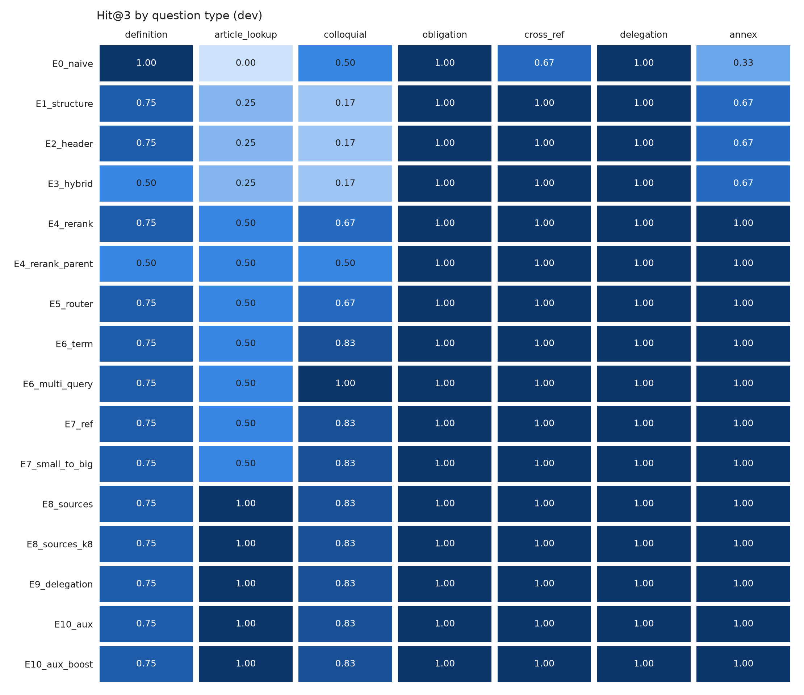

# 로봇 (Law-bot)

**AI 기본법을 조문 근거와 함께 답해주는 RAG QA 백엔드** — `POST /ask`

「인공지능 발전과 신뢰 기반 조성 등에 관한 기본법」(법률)·시행령·별표·고시를 국가법령정보 공동활용 Open API로 수집해,
질문에 **검색된 조문 안에서만** 답하고 모든 주장에 `[법 제31조 제2항]`, `[영 별표 2]` 같은 인용을 단다.
목표는 기법을 많이 쓰는 것이 아니라 **어떤 기법이 검색을 실제로 개선했는지 수치로 보이는 것**이다.

- 설계: [`docs/DESIGN.md`](docs/DESIGN.md) · 진행: [`docs/TASKS.md`](docs/TASKS.md) · 실험: [`docs/EXPERIMENTS.md`](docs/EXPERIMENTS.md) · 위임 그래프: [`docs/delegation_graph.md`](docs/delegation_graph.md)
- 개발 환경(uv) 상세: [`docs/UV_SETUP.md`](docs/UV_SETUP.md)

## 실행

`.env.example`을 복사해 `.env`를 만들고 `LLM_API_KEY`, `LLM_BASE_URL`, `LAW_OC`, `CREDIT_PER_1K_*`를 채운다.

```bash
uv sync
docker compose -f docker-qdrant/docker-compose.yaml up -d      # Qdrant :6333/dashboard

uv run python -m rag.loader --refresh          # (필요할 때만) Open API 수집 → data/raw/
uv run python -m rag.chunker --dry-run         # 청킹 → data/processed/chunks.jsonl, delegation_graph.json
uv run python -m rag.vectorstore --rebuild     # 임베딩·Qdrant 적재 (임베딩 캐시 사용)

uv run uvicorn app.main:app --reload           # API :8000/docs
uv run pytest -q
```

```bash
curl -s -X POST localhost:8000/ask -H "Content-Type: application/json" \
  -d '{"question":"국내대리인을 지정하지 않으면 과태료가 얼마인가요?","debug":true}'
```

응답: `answer`, `sources[]`(`article`, `source_type`, `citation`, `content`, `score`, `cited`, `added_by`), `notice`(AI 생성 표시), `grounded`, `data_snapshot`, `debug`(후보·단계별 점수·warnings·토큰).
`GET /health`: Qdrant 연결, 원천별 포인트 수, 서비스 프리셋, 데이터 수집 일자.

### 평가

```bash
uv run python -m eval.evaluate --config E3_hybrid,E9_delegation   # 검색 지표 (dev)
uv run python -m eval.evaluate --config full --answer             # 답변+judge (실행 전 예상 크레딧 확인)
uv run python -m eval.report --chart --mermaid                    # ablation 표·히트맵·위임 그래프
uv run python -m common.usage --summary                           # 누적 토큰·크레딧, 잔여 예산
```

## 데이터 원천 (snapshot 2026-10-08, `data/sources.yaml`)

| source_type | 내용 | 청크 |
|---|---|---|
| `law` | 인공지능기본법 (MST 282791, 법률 제21311호) | 108 |
| `decree` | 같은 법 시행령 (MST 288781, 대통령령 제36580호) | 87 |
| `annex` | 시행령 별표 1(이행조치 인정 기준), 별표 2(과태료 부과기준) — 시행령 본문의 고정폭 표를 파싱, 행 단위 청크 | 26 |
| `admrul` | 인공지능제품ㆍ서비스 확인 절차 운영에 관한 고시 (과기정통부) | 9 |
| `term` | 법령용어 (인공지능기본법 정의어) | 6 |

API 원문은 `data/raw/`에 캐시하고 파이프라인은 캐시를 읽는다. 서비스는 런타임에 law.go.kr을 호출하지 않는다.

## 아키텍처

```
Offline  law_api(캐시) → loader → chunker(조/항/호, 별표 행, 위임 그래프) → vectorstore(Qdrant, dense)
Online   질의 준비(term expansion / multi-query)
         → dense + BM25(kiwi) → RRF → rerank(CrossEncoder) → priority boost → small-to-big → top_k
         → router(제N조·별표 N 고정) → ref expansion → delegation expansion(법 → 영 → 별표)
         → 근거 컨텍스트(6k 토큰) → LLM → 인용·숫자 후검증 → 응답
```

- 모든 기법은 `rag/config.py`의 `RetrievalConfig` 플래그로 켜고 끈다. 프리셋 E0~E10이 "직전 + 플래그 1개"로 쌓여 ablation이 된다.
- **위임 확장**: 법률 조문의 "대통령령으로 정한다"를 시행령 조·별표로 연결한 그래프(`delegation_graph.json`, 위임 간선 57개)를 따라 하위 법령 근거를 붙인다. 예: 법 제43조(과태료) → 영 제32조 → 영 별표 2(금액표).
- **후검증**(`rag/grounding.py`): 검색 결과에 없는 인용은 제거하고 warnings에 남긴다. 답변의 금액·기간이 근거 텍스트에 없으면 경고한다(`3천만원`=`3,000만원`, 별표 `(단위: 만원)` 해석).
- **비용**: LLM 호출은 `common/cache.py`(sqlite) 캐시, 임베딩은 `rag/embeddings.py` 캐시를 거친다. 사용량은 `eval/usage_ledger.jsonl`에 누적.

## 결과 (dev 33문항, 거절 4문항 제외 29문항)

| 실험 | 설정 | Hit@1 | Hit@3 | Hit@5 | MRR | Cand-R@20 |
|---|---|---|---|---|---|---|
| E0 | naive 500자 + dense | 0.517 | 0.655 | 0.724 | 0.590 | (0.621) |
| E1 | 구조 청킹 + dense | 0.586 | 0.655 | 0.690 | 0.629 | 0.586 |
| E2 | + contextual header | 0.552 | 0.655 | 0.655 | 0.586 | 0.517 |
| E3 | + BM25 + RRF | 0.483 | 0.621 | 0.690 | 0.563 | 0.603 |
| E4 | + Rerank (bge-reranker-v2-m3) | 0.759 | 0.828 | 0.828 | 0.787 | 0.603 |
| E6 | + Term expansion (E5 Router 포함) | 0.793 | 0.862 | 0.897 | 0.836 | 0.621 |
| E8 | + 원천 추가 (시행령·별표) | 0.862 | 0.931 | 0.966 | 0.898 | 0.897 |
| E9 | + Delegation expansion | 0.862 | 0.931 | 0.966 | 0.898 | 0.897 |
| **E10 (서비스 `full`)** | + 보조 원천 (고시·용어) | 0.862 | 0.931 | 0.931 | 0.891 | 0.931 |

조 단위 완전 재현율(Full-Recall@ctx): E4 0.143 → E8 **0.714** → E9 0.809 → E10 **0.905** (결과 개수만 8개로 늘린 대조군 E8_k8은 0.714). 위임 확장은 개수 통제 대조에서 이득이 확인됐지만 test split(11문항)에서는 재현되지 않았다.

**test split 최종 평가** (11문항): E0 Hit@1 0.545 → E10 **1.000**, Full-R@ctx 0.000 → **1.000** ([`ablation_test.md`](eval/results/ablation_test.md)).

**답변 평가** (LLM judge, E10): dev correctness 4.24 · faithfulness 3.38 · 근거 인용 100% · 숫자 불일치 0 · 거절 정확도 1.0 / test correctness 4.27 · 환각 인용 2/12(후처리로 제거).

Before/After 데모 3개: [`docs/DEMO.md`](docs/DEMO.md). 비용 정리: [`docs/EXPERIMENTS.md`](docs/EXPERIMENTS.md) T6.1b.



해석과 채택/기각 사유는 [`docs/EXPERIMENTS.md`](docs/EXPERIMENTS.md). 1문항 = 0.034이므로 1~2문항 차이는 노이즈로 본다.

## 한계

- 응답 지연은 CPU rerank·LLM 때문에 질문당 약 11~13초다(검색만 약 0.9초).
- 제재·참조 질문(예: 미고지 시 제재 → 법 제43조)은 역방향 참조(`referenced_by`)가 없어 실패한다. 정의 비교형 질문(인공지능 vs 인공지능시스템)은 정의 호 검색이 누락될 수 있다.
- 법령해석례(`expc`)는 `query=인공지능` 결과가 0건(2026-10-08)이라 수집하지 않았다.
- 골든셋은 45문항(dev 33 / test 12)으로 작아 유형별 수치는 방향만 본다. 튜닝은 dev에서만, test는 최종 1회.
- Term expansion 사전(`data/term_synonyms.yaml`)은 수작업이다. 일반 표현으로 작성했지만 사전 품질이 성능을 좌우한다.
- 데이터는 수집 시점(snapshot) 기준이다. 법령이 개정되면 `sources.yaml`의 MST를 갱신하고 재수집·재적재해야 한다.
- 답변은 법률 자문이 아니다(`notice` 필드로 표시).
