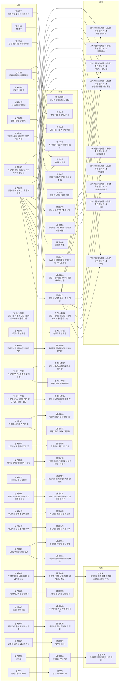

# 위임 그래프

`data/processed/delegation_graph.json`의 위임 간선 57개(법률 → 시행령 → 별표·고시). `uv run python -m eval.report --mermaid`로 재생성.

```mermaid
flowchart LR
  subgraph law[법률]
    law_a3["법 제3조<br/>기본원칙 및 국가 등의 책무"]
    law_a4["법 제4조<br/>적용범위"]
    law_a6["법 제6조<br/>인공지능 기본계획의 수립"]
    law_a7["법 제7조<br/>국가인공지능전략위원회"]
    law_a10["법 제10조<br/>분과위원회 등"]
    law_a11["법 제11조<br/>인공지능정책센터"]
    law_a12["법 제12조<br/>인공지능안전연구소"]
    law_a13["법 제13조<br/>인공지능기술 개발 및 안전한 이용 지원"]
    law_a15["법 제15조<br/>인공지능 학습용데이터 관련 시책의 수립 등"]
    law_a16["법 제16조<br/>인공지능기술 도입ㆍ활용 시책 등"]
    law_a17_2["법 제17조의2<br/>인공지능제품 및 인공지능서비스 이용비용의 지원"]
    law_a18["법 제18조<br/>창업의 활성화 등"]
    law_a22["법 제22조<br/>국제협력 및 해외시장 진출의 지원"]
    law_a22_2["법 제22조의2<br/>인공지능연구소의 설립 및 지원 등"]
    law_a22_3["법 제22조의3<br/>인공지능기술 확보를 위한 연구기관의 설립ㆍ운영"]
    law_a23["법 제23조<br/>인공지능집적단지 지정 등"]
    law_a24["법 제24조<br/>인공지능 실증기반 조성 등"]
    law_a26["법 제26조<br/>한국인공지능진흥협회의 설립"]
    law_a27["법 제27조<br/>인공지능 윤리원칙 등"]
    law_a30["법 제30조<br/>인공지능 안전성ㆍ신뢰성 검ㆍ인증등 지원"]
    law_a31["법 제31조<br/>인공지능 투명성 확보 의무"]
    law_a32["법 제32조<br/>인공지능 안전성 확보 의무"]
    law_a33["법 제33조<br/>고영향 인공지능의 확인"]
    law_a34["법 제34조<br/>고영향 인공지능과 관련한 사업자의 책무"]
    law_a35["법 제35조<br/>고영향 인공지능 영향평가"]
    law_a36["법 제36조<br/>국내대리인 지정"]
    law_a38["법 제38조<br/>실태조사, 통계 및 지표의 작성"]
    law_a39["법 제39조<br/>권한의 위임 및 업무의 위탁"]
    law_a43["법 제43조<br/>과태료"]
    law_add1["법 부칙<br/>부칙 <제20676호>"]
  end
  subgraph decree[시행령]
    decree_a1_2["영 제1조의2<br/>인공지능취약계층의 범위"]
    decree_a2["영 제2조<br/>법의 적용 제외 인공지능"]
    decree_a3["영 제3조<br/>인공지능 기본계획의 수립"]
    decree_a4["영 제4조<br/>국가인공지능전략위원회의 구성 등"]
    decree_a6["영 제6조<br/>국가인공지능전략위원회지원단"]
    decree_a8["영 제8조<br/>분과위원회 등"]
    decree_a9["영 제9조<br/>인공지능정책센터의 지정"]
    decree_a10["영 제10조<br/>인공지능안전연구소의 운영 등"]
    decree_a11["영 제11조<br/>인공지능기술 개발 및 안전한 이용 지원"]
    decree_a12["영 제12조<br/>인공지능 학습용데이터 지원대상사업 등"]
    decree_a13["영 제13조<br/>학습용데이터 통합제공시스템의 구축 및 관리"]
    decree_a14["영 제14조<br/>비용의 징수"]
    decree_a15["영 제15조<br/>인공지능기술 도입ㆍ활용 지원"]
    decree_a15_2["영 제15조의2<br/>인공지능제품 및 인공지능서비스 이용비용의 지원"]
    decree_a15_3["영 제15조의3<br/>창업의 활성화 등"]
    decree_a16["영 제16조<br/>국제협력 및 해외시장 진출 지원 위탁"]
    decree_a16_2["영 제16조의2<br/>인공지능연구소의 설립"]
    decree_a16_3["영 제16조의3<br/>인공지능연구소의 설립허가 절차 등"]
    decree_a16_4["영 제16조의4<br/>인공지능연구기관의 설립 준비"]
    decree_a17["영 제17조<br/>인공지능집적단지 지정 등"]
    decree_a18["영 제18조<br/>인공지능집적단지 전담기관"]
    decree_a19["영 제19조<br/>인공지능 실증기반 조성"]
    decree_a20["영 제20조<br/>한국인공지능진흥협회의 설립인가ㆍ지정 등"]
    decree_a21["영 제21조<br/>인공지능 윤리원칙의 제정 및 공표"]
    decree_a22["영 제22조<br/>인공지능 안전성ㆍ신뢰성 검ㆍ인증등 지원"]
    decree_a23["영 제23조<br/>인공지능 투명성 확보 의무"]
    decree_a24["영 제24조<br/>인공지능 안전성 확보 의무"]
    decree_a25["영 제25조<br/>고영향 인공지능의 확인 절차 등"]
    decree_a26["영 제26조<br/>전문위원회의 설치 및 운영"]
    decree_a27["영 제27조<br/>고영향 인공지능과 관련한 사업자의 책무"]
    decree_a28["영 제28조<br/>고영향 인공지능 영향평가"]
    decree_a29["영 제29조<br/>국내대리인 지정 사업자의 기준"]
    decree_a30["영 제30조<br/>실태조사, 통계 및 지표의 작성"]
    decree_a31["영 제31조<br/>업무의 위탁"]
    decree_a32["영 제32조<br/>과태료의 부과기준"]
    decree_add1["영 부칙<br/>부칙 <제36053호>"]
  end
  subgraph annex[별표]
    annex_1["영 별표 1<br/>이행조치 인정 기준 및 절차(제27조제5항 관련)"]
    annex_2["영 별표 2<br/>과태료의 부과기준(제32조 관련)"]
  end
  subgraph admrul[고시]
    admrul_2100000283290_a1["고시 인공지능제품ㆍ서비스 확인 절차 제1조<br/>목적"]
    admrul_2100000283290_a2["고시 인공지능제품ㆍ서비스 확인 절차 제2조<br/>정의"]
    admrul_2100000283290_a3["고시 인공지능제품ㆍ서비스 확인 절차 제3조<br/>확인 제외 대상"]
    admrul_2100000283290_a4["고시 인공지능제품ㆍ서비스 확인 절차 제4조<br/>확인신청"]
    admrul_2100000283290_a5["고시 인공지능제품ㆍ서비스 확인 절차 제5조<br/>확인기준 등"]
    admrul_2100000283290_a6["고시 인공지능제품ㆍ서비스 확인 절차 제6조<br/>인공지능 활용 여부 결정"]
    admrul_2100000283290_a7["고시 인공지능제품ㆍ서비스 확인 절차 제7조<br/>확인서의 발급 등"]
    admrul_2100000283290_a8["고시 인공지능제품ㆍ서비스 확인 절차 제8조<br/>확인 취소"]
    admrul_2100000283290_a9["고시 인공지능제품ㆍ서비스 확인 절차 제9조<br/>비밀유지의무"]
  end
  law_a3 --> decree_a1_2
  law_a4 --> decree_a2
  law_a6 --> decree_a3
  law_a7 --> decree_a4
  law_a7 --> decree_a6
  law_a7 --> decree_a8
  law_a10 --> decree_a8
  law_a11 --> decree_a9
  law_a12 --> decree_a10
  law_a13 --> decree_a11
  law_a15 --> decree_a12
  law_a15 --> decree_a13
  law_a15 --> decree_a14
  law_a16 --> decree_a15
  law_a17_2 --> decree_a15_2
  law_a18 --> decree_a15_3
  law_a22 --> decree_a16
  law_a22_2 --> decree_a16_2
  law_a22_2 --> decree_a16_3
  law_a22_3 --> decree_a16_4
  law_a23 --> decree_a17
  law_a23 --> decree_a18
  law_a24 --> decree_a19
  law_a26 --> decree_a20
  law_a27 --> decree_a21
  law_a30 --> decree_a22
  law_a31 --> decree_a23
  law_a32 --> decree_a24
  law_a33 --> decree_a25
  law_a33 --> decree_a26
  law_a34 --> decree_a27
  decree_a27 --> annex_1
  law_a35 --> decree_a28
  law_a36 --> decree_a29
  law_a38 --> decree_a30
  law_a39 --> decree_a31
  law_a43 --> decree_a32
  decree_a32 --> annex_2
  law_add1 --> decree_add1
  law_a16 --> admrul_2100000283290_a1
  decree_a15 --> admrul_2100000283290_a1
  law_a16 --> admrul_2100000283290_a2
  decree_a15 --> admrul_2100000283290_a2
  law_a16 --> admrul_2100000283290_a3
  decree_a15 --> admrul_2100000283290_a3
  law_a16 --> admrul_2100000283290_a4
  decree_a15 --> admrul_2100000283290_a4
  law_a16 --> admrul_2100000283290_a5
  decree_a15 --> admrul_2100000283290_a5
  law_a16 --> admrul_2100000283290_a6
  decree_a15 --> admrul_2100000283290_a6
  law_a16 --> admrul_2100000283290_a7
  decree_a15 --> admrul_2100000283290_a7
  law_a16 --> admrul_2100000283290_a8
  decree_a15 --> admrul_2100000283290_a8
  law_a16 --> admrul_2100000283290_a9
  decree_a15 --> admrul_2100000283290_a9
```
